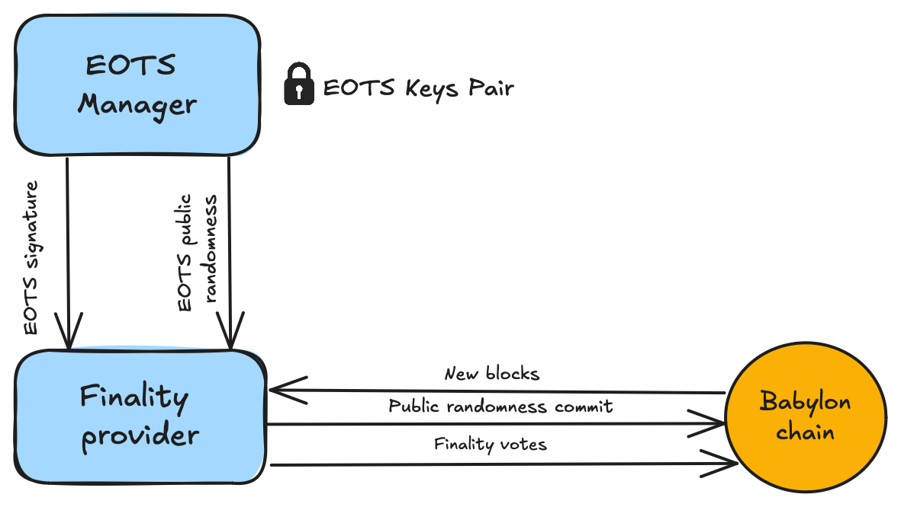

# Finality Provider

A toolset crafted for the creation and
management of Finality Providers.

## 1. Overview

Finality providers are key participants in Babylon BTC staking protocol.
They provide finality votes on top of
[CometBFT](https://github.com/cometbft/cometbft), Babylon's consensus mechanism.
Through these activities, they can earn commissions from BTC staking delegations.

The finality provider toolset operates on standard UNIX-based 
systems and consists of three core components:

### 1. Babylon Full Node
A Babylon network node that provides chain data and transaction 
submission capabilities. While not mandatory, running your own node is 
strongly recommended for security rather than relying on third-party RPC nodes. 
See the [Setup Node Guide](https://docs.babylonchain.io/docs/user-guides/btc-staking-testnet/setup-node) for details.

### 2. Extractable One-Time Signature (EOTS) Manager
A secure key management daemon that handles EOTS key operations, 
generates extractable one-time signatures, and produces public randomness. 
For enhanced security, this component should run on a separate machine or 
network segment. Full details are available in the [EOTS Manager Guide](docs/eots.md).

### 3. Finality Provider Daemon
The core daemon that polls Babylon blocks, commits public randomness, and 
submits finality signatures. It manages provider status transitions and handles 
rewards distribution. See the [Finality Provider Guide](docs/finality-provider.md) 
for complete documentation.

### Component Interactions
The Finality Provider daemon communicates with the Babylon Node to monitor blocks 
and submit transactions. It interacts with the EOTS Manager for signature and 
randomness generation. The EOTS Manager maintains secure key storage and handles 
all EOTS key operations.



## 2. Installation

### Prerequisites

This project requires Go version 1.23 or later.

Install Go by following the instructions on
the [official Go installation guide](https://golang.org/doc/install).

### Downloading the code

To get started, clone the repository to your local machine from Github:

```bash
git clone https://github.com/babylonlabs-io/finality-provider.git
```

You can choose a specific version from
the [official releases page](https://github.com/babylonlabs-io/finality-provider/releases)

```bash
cd finality-provider # cd into the project directory
git checkout <release-tag>
```

### Building and installing the binary

At the top-level directory of the project

```bash
make install
```

The above command will build and install the following binaries to
`$GOPATH/bin`:

- `eotsd`: The daemon program for the EOTS manager.
- `fpd`: The daemon program for the finality-provider with overall commands.

If your shell cannot find the installed binaries, make sure `$GOPATH/bin` is in
the `$PATH` of your shell. Usually these commands will do the job

```bash
export PATH=$HOME/go/bin:$PATH
echo 'export PATH=$HOME/go/bin:$PATH' >> ~/.profile
```

## 3. Setting up a finality provider

### 3.1. Setting up a Babylon Full Node

Before setting up the finality provider toolset,
an operator must ensure a working connection with a Babylon full node.
It is highly recommended that operators run their own node to avoid
trusting third parties. Instructions on how to set up a full Babylon node
can be found in
[the Babylon documentation](https://docs.babylonchain.io/docs/user-guides/btc-staking-testnet/setup-node).
<!-- TODO: Replace the link when available-->

### 3.2. Setting up the EOTS Manager

After a node and a keyring have been set up,
the operator can set up and run the
Extractable One Time Signature (EOTS) manager daemon.
A complete overview of the EOTS manager, its operation, and
its configuration options can be found in the
[EOTS Manager page](docs/eots.md)

### 3.3. Setting up a Finality Provider

The last step is to set up and run
the finality daemon.
A complete overview of the finality daemon, its operation, and
its configuration options can be found in the
[Finality page](docs/finality-provider.md).

## 4. Delegations & Rewards

A finality provider receives BTC delegations through delegators
interacting with Babylon and choosing it as the recipient of their delegations.
To perform a self-delegation,
the operator can either visit the staking web app we provide,
or run the Babylon [BTC Staker program](https://github.com/babylonlabs-io/btc-staker) once.
The BTC staker connects to a Bitcoin wallet and Babylon to perform delegations.
