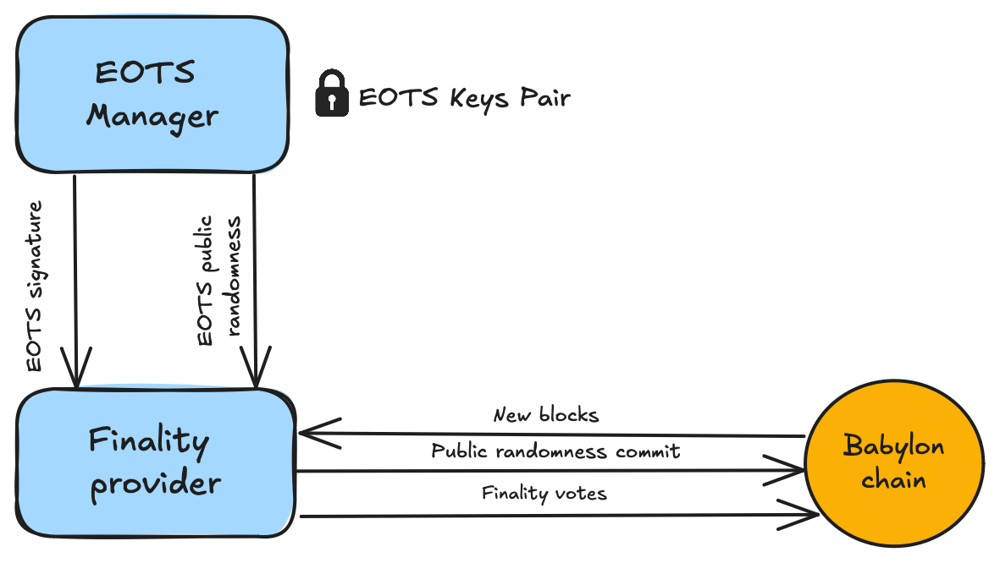

# Finality Provider

Finality providers are key participants in the Babylon BTC staking protocol.
They provide finality votes on top of
[CometBFT](https://github.com/cometbft/cometbft), Babylon's consensus mechanism,
and earn commissions from BTC staking delegations.

The finality provider toolset operates on standard UNIX-based
systems and consists of three core components:

1. **Babylon Genesis Node**:
A Babylon Genesis network node that provides chain data and transaction
submission capabilities. While not mandatory, running your own node is
strongly recommended for security rather than relying on third-party RPC nodes.
See the [Setup Node Guide](https://github.com/babylonlabs-io/networks/blob/main/bbn-test-5/babylon-node/README.md) 
for details.
2. **Extractable One-Time Signature (EOTS) Manager**:
A secure key management daemon that handles EOTS key operations,
generates extractable one-time signatures, and produces public randomness.
For enhanced security, this component should run on a separate machine or
network segment.
3. **Finality Provider Daemon**:
The core daemon that polls Babylon Genesis blocks, commits public randomness, and
submits finality signatures. It manages the finality provider's status transitions
and handles rewards distribution.

**Component Interactions**:
The Finality Provider daemon communicates with the Babylon Genesis Node to monitor blocks
and submit transactions. It interacts with the EOTS Manager for signature and
randomness generation. The EOTS Manager maintains secure key storage and handles
all EOTS key operations.

## Become a Finality Provider

For instructions on creating and operating a finality provider,
see our [Finality Provider Guide](./docs/finality-provider-operation.md).

## High Level Descriptions of EOTS and Finality Provider

<!-- These are out of place right now, we need to decide where to place them -->
### EOTS Manager

The EOTS daemon is responsible for managing EOTS keys, producing EOTS randomness, and
using them to produce EOTS signatures.

> ⚡ **Note:** EOTS stands for Extractable One Time Signature. You can read more about it
in
the [Babylon BTC Staking Litepaper](https://docs.babylonchain.io/assets/files/btc_staking_litepaper-32bfea0c243773f0bfac63e148387aef.pdf).
In short, the EOTS manager generates EOTS public/private randomness pairs. The
finality provider commits the public part of these pairs to Babylon Genesis for every future
block height that they intend to provide a finality signature for. If the finality
provider votes for two different blocks on the same height, they will have to reuse
the same private randomness which will lead to their EOTS private key being
exposed, leading to the slashing. 

Once a finality provider is double-signs, their voting power is immediately reduced
to zero, while their private key is exposed. A finality provider that double-signs
can never regain voting power (tombstoning). Additionally, the exposed private key
of the finality provider can be used to fully sign the slashing transactions of all
their stake delegations.

The EOTS manager is responsible for the following operations:

1. **EOTS Key Management:**
    - Generates [Schnorr](https://en.wikipedia.org/wiki/Schnorr_signature) key pairs
      for a given finality provider using the
      [BIP-340](https://github.com/bitcoin/bips/blob/master/bip-0340.mediawiki)
      standard as its EOTS key pair
    - Persists generated key pairs in the internal Cosmos keyring.
2. **Randomness Generation:**
    - Generates lists of EOTS randomness pairs based on the EOTS key, chain ID, and
      block height.
    - The randomness is deterministically generated and tied to specific parameters.
3. **Signature Generation:**
    - Signs EOTS using the private key of the finality provider and the corresponding
      secret randomness for a given chain at a specified height.
    - Signs Schnorr signatures using the private key of the finality provider.

### Finality Provider

The Finality Provider Daemon is responsible for monitoring for new Babylon Genesis blocks,
committing public randomness for the blocks it intends to provide finality signatures
for, and submitting finality signatures.

The daemon can manage multiple finality providers but only run a single
finality provider instance at a time performing the following operations:

1. **Creation and Registration**: Creates and registers a finality provider to.

2. **EOTS Randomness Commitment**: The daemon monitors Babylon Genesis and commits
   EOTS public randomness for every Babylon Genesis block the finality provider intends to
   vote for. The commit intervals can be specified in the configuration.

3. **Finality Votes Submission**: The daemon monitors Babylon Genesis and produces
   finality votes for each block the finality provider has committed to vote for.

4. **Status Management**: The daemon continuously monitors voting power and overall
   provider status. It manages state transitions between `ACTIVE`, `INACTIVE`,
   `JAILED`, and `SLASHED` states, while handling the jailing process when violations
   occur.

5. **Security and Key Management**: The daemon manages Babylon Genesis keys for signing
    transactions and rewards distribution. It maintains secure coordination with
    the EOTS daemon for all key-related operations.

The daemon is controlled by the `fpd` tool, which provides commands for
interacting with the running daemon.

## Technical Documentation

For detailed technical information about the finality provider's internal operations, see:
* [Core Heuristics](./docs/fp-core.md)
* [Public Randomness Commits](./docs/commit-pub-rand.md)
* [Finality Votes submission](./docs/send-finality-vote.md)
* [Slashing Protection](./docs/slashing-protection.md)

## Overview of Keys for Finality Provider and EOTS Manager

There are two distinct keys you'll be working with:

- **EOTS Key**:
    - Used for generating EOTS signatures, Schnorr signatures, and randomness pairs
    - This serves as the unique identifier for the finality provider
    - It's derived from a Bitcoin private key, using the secp256k1
      elliptic curve.
    - Stored in the EOTS manager daemon's keyring
    - This key is used in the Bitcoin-based security model of Babylon.

- **Babylon Genesis Key**:
    - Used for signing transactions on Babylon.
    - Associated with a Babylon Genesis account that receives rewards
    - Stored in the finality provider daemon's keyring

This dual association allows the finality provider to interact with both the
Bitcoin network (for security) and the Babylon Genesis network (for rewards and
governance).

Once a finality provider is created, neither key can be rotated or changed -
they are permanently associated with that specific finality provider instance.
