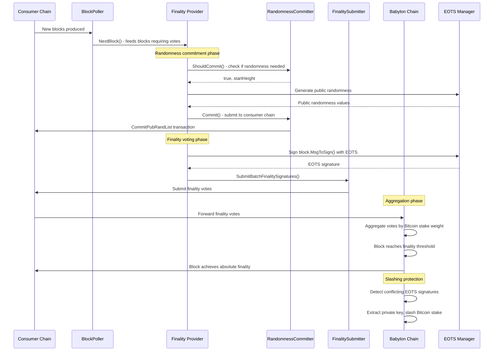

# Finality Provider SDK Developer Guide

## Table of Contents

1. [Introduction](#introduction)
2. [Constructor Pattern](#constructor-pattern)
   - [Default Usage](#default-usage)
   - [Custom Usage](#custom-usage)
   - [Interface Responsibilities](#interface-responsibilities)
3. [Finality Process Flow](#finality-process-flow)
4. [Interfaces](#interfaces)
   - [ConsumerController Interface](#consumercontroller-interface)
   - [Block Polling Interface](#block-polling-interface)
   - [Randomness Committer Interface](#randomness-committer-interface)
   - [Finality Signature Submitter Interface](#finality-signature-submitter-interface)
   - [Height Determiner Interface](#height-determiner-interface)
5. [Instantiation](#instantiation)
   - [Using Built-in Implementations](#using-built-in-implementations)
   - [Using Custom Implementations](#using-custom-implementations)
6. [Startup](#startup)

## Introduction

The Finality Provider SDK enables Bitcoin Supercharged Networks (BSNs) to 
integrate with Babylon's Bitcoin-secured finality infrastructure as a flexible 
library. It provides finality guarantees for consumer chain blocks through 
EOTS (Extractable One-Time Signatures) and BTC staking.

The SDK offers a modular, interface-based architecture that allows teams to 
customise components for their specific blockchain implementations while 
maintaining compatibility with the core finality provider functionality.

The SDK includes two reference implementations:
- **Cosmos chains** - Uses CosmWasm smart contracts for finality coordination  
  ([implementation](../bsn/cosmos/), [config](../bsn/cosmos/config/))
- **Rollup chains** - Uses Ethereum-compatible smart contracts for finality 
  coordination ([implementation](../bsn/rollup/), [config](../bsn/rollup/config/))

Both implementations demonstrate the same extensible interface pattern, 
enabling BSNs to create custom implementations for any consumer chain type 
by implementing [well-defined interfaces](../clientcontroller/api/interface.go) 
rather than modifying core logic.

## Constructor Pattern

The BSN SDK uses `service.NewFinalityProviderApp()` as the core constructor
pattern. It supports two usage modes:

### Default Usage
Use built-in implementations with constructors. These create all
required interfaces internally with default implementations:

```go
// Cosmos chains - Uses CosmWasm client, Cosmos SDK queries
fpApp, err := cosmosservice.NewCosmosBSNFinalityProviderAppFromConfig(
    cfg, db, logger)

// Rollup chains - Uses Ethereum RPC client, JSON-RPC queries
fpApp, err := rollupservice.NewRollupBSNFinalityProviderAppFromConfig(
    cfg, db, logger)
```

Both internally call [`service.NewFinalityProviderApp()`](../finality-provider/service/app.go)
with pre-configured implementations.

### Custom Usage
Implement your own interfaces and call the core constructor directly. This
allows custom consumer chain types beyond Cosmos/Rollup:

```go
fpApp, err := service.NewFinalityProviderApp(
    config,              // *fpcfg.Config 
    babylonController,   // ccapi.BabylonController 
    consumerController,  // ccapi.ConsumerController - Can be customised
    eotsManager,         // eotsmanager.EOTSManager 
    blockPoller,         // types.BlockPoller - Can be customised
    randomnessCommitter, // types.RandomnessCommitter - Can be customised
    heightDeterminer,    // types.HeightDeterminer 
    finalitySubmitter,   // types.FinalitySignatureSubmitter - Can be customised
    metrics,             // *metrics.FpMetrics - Metrics collection
    db,                  // kvdb.Backend - Database for state persistence
    logger,              // *zap.Logger - Structured logging
)
```
- [`service.NewFinalityProviderApp()`](../finality-provider/service/app.go) - Core constructor for finality provider application

### Interface Responsibilities

- **`ccapi.ConsumerController`** - Primary interface. Handles block queries,
  finality signature submission, randomness commits to your consumer chain
- **`types.BlockPoller`** - Monitors consumer chain blocks. Emits channel of
  new blocks requiring finality votes based on your chain's finality rules
- **`types.RandomnessCommitter`** - Pre-commits EOTS public randomness.
  Required before finality signatures to enable slashing detection
- **`types.FinalitySignatureSubmitter`** - Submits batched EOTS finality
  signatures. Coordinates with randomness commits for proper EOTS verification
- **`types.HeightDeterminer`** - Calculates finality voting start height.
  Usually built-in implementation sufficient
- **`ccapi.BabylonController`** - Babylon chain operations (FP registration,
  BTC staking queries). Use built-in unless custom Babylon integration
- **`eotsmanager.EOTSManager`** - EOTS key management and signature generation.
  Use built-in unless custom HSM integration

## Finality Process Flow

The following diagram illustrates how blocks flow through the Bitcoin-secured finality system:



### Implementation References

Each step in this flow maps to specific code locations:

1. [Block Polling](../finality-provider/service/chain_poller.go) - 
   `NextBlock()`
2. [Randomness Commitment](../finality-provider/service/fp_instance.go)
   (../finality-provider/service/fp_instance.go#L324) - `randomnessCommitmentLoop()`
3. [Finality Voting](../finality-provider/service/fp_instance.go) - 
   `finalitySigSubmissionLoop()`
4. Aggregation: Handled by Babylon chain consensus
5. Slashing: EOTS + Babylon chain 

Every block's `MsgToSign()` generates the exact message that receives 
Bitcoin security through the EOTS signature scheme.

## Interfaces

### ConsumerController Interface

The primary interface for consumer chain integration. Composes three
sub-interfaces for separation of concerns into a single contract. This is the 
main interface BSNs implement to connect their consumer chain to Babylon's 
Bitcoin-secured finality system.

The one interface allows for a single integration rather than managing 3 
separate dependencies and handles all finality aspects (randomness, querying, 
voting).

```go
type ConsumerController interface {
    RandomnessCommitter    // Public randomness operations
    BlockQuerier[types.BlockDescription]  // Chain state queries
    FinalityOperator      // Finality signature operations
    Close() error         // Cleanup connections
}
```

- [`ConsumerController` interface](../clientcontroller/api/interface.go) - Main interface definition in the codebase

**Sub-interfaces:**

```go
type RandomnessCommitter interface {
    GetFpRandCommitContext() string
    CommitPubRandList(ctx context.Context, req *CommitPubRandListRequest) (
        *types.TxResponse, error)
    QueryLastPublicRandCommit(ctx context.Context, fpPk *btcec.PublicKey) (
        *types.PubRandCommit, error)
}

type BlockQuerier[T types.BlockDescription] interface {
    QueryLatestFinalizedBlock(ctx context.Context) (T, error)
    QueryBlock(ctx context.Context, height uint64) (T, error)
    QueryIsBlockFinalized(ctx context.Context, height uint64) (bool, error)
    QueryBlocks(ctx context.Context, req *QueryBlocksRequest) ([]T, error)
    QueryLatestBlock(ctx context.Context) (T, error)
    QueryFinalityActivationBlockHeight(ctx context.Context) (uint64, error)
}

type FinalityOperator interface {
    GetFpFinVoteContext() string
    SubmitBatchFinalitySigs(ctx context.Context, 
        req *SubmitBatchFinalitySigsRequest) (*types.TxResponse, error)
    UnjailFinalityProvider(ctx context.Context, fpPk *btcec.PublicKey) (
        *types.TxResponse, error)
    QueryFinalityProviderHasPower(ctx context.Context, 
        req *QueryFinalityProviderHasPowerRequest) (bool, error)
    QueryFinalityProviderStatus(ctx context.Context, fpPk *btcec.PublicKey) (
        *FinalityProviderStatusResponse, error)
	
    QueryFinalityProviderHighestVotedHeight(ctx context.Context, 
        fpPk *btcec.PublicKey) (uint64, error)
}
```

**Sub-interface references:**
- All sub-interfaces are also defined in [`clientcontroller/api/interface.go`](../clientcontroller/api/interface.go)

### Block Polling Interface

The BlockPoller sits between the consumer chain and the finality providers,
monitors the consumer chain for new blocks, then feeds
those blocks through a channel to finality providers for voting. The generic
type parameter `T` must implement the BlockDescription interface, enabling
BSNs to attach chain-specific data while ensuring every block provides
the core methods also needed. Additionally, every block must provide `MsgToSign
()` which generates the exact message that will be signed by EOTS.

```go
type BlockPoller[T BlockDescription] interface {
    // NextBlock returns the next block requiring finality vote
    // Blocks until a block is available or context is cancelled
    NextBlock(ctx context.Context) (T, error)
    
    // TryNextBlock non-blocking version that returns immediately
    // Returns (block, true) if available, (nil, false) if not
    TryNextBlock() (T, bool)
    
    // SetStartHeight configures the starting point for block polling
    // Allows resuming from a specific height after restarts
    SetStartHeight(ctx context.Context, height uint64) error
    
    // NextHeight returns the next height to poll for
    // Useful for tracking polling progress and debugging
    NextHeight() uint64
    
    // Stop gracefully stops the poller
    Stop() error
}
```

- [`BlockPoller` interface](../types/expected_block.go) - Interface definition in the codebase

### Randomness Committer Interface

The `RandomnessCommitter` interface separates the information on committing
randomness, abstracting both when and how to commit randomness, and allows
BSNs to implement custom commitment strategies e.g. commit every N blocks. 
This enables BSNs to customise commitment behavior based on their specific 
requirements.

For example, chains with higher gas costs might implement larger batch 
sizes to minimise transaction costs, while other chains might want to commit 
more frequently with smaller batches to reduce finality latency.

```go
type RandomnessCommitter interface {
    // ShouldCommit determines whether randomness should be committed
    // Returns commitment decision, start height, and any error
    // Enables custom strategies for commitment timing and batching
    ShouldCommit(ctx context.Context) (should bool, startHeight uint64, err error)
    
    // Commit performs the actual randomness commitment to the consumer chain
    // BSNs implement chain-specific transaction logic here
    Commit(ctx context.Context, startHeight uint64) (*TxResponse, error)
    
    // GetLastCommittedHeight retrieves the last successfully committed height
    // Used for recovery and ensuring commitment continuity after restarts
    GetLastCommittedHeight(ctx context.Context) (uint64, error)
    
    // GetPubRandProofList retrieves cryptographic proofs for committed randomness
    // Required for EOTS signature generation and slashing detection
    GetPubRandProofList(height uint64, numPubRand uint64) ([][]byte, error)
    
    // Init initializes the committer with finality provider identity
    // Associates the committer with a specific BTC key and chain
    Init(btcPk *types.BIP340PubKey, chainID []byte) error
}
```

- [`RandomnessCommitter` interface](../types/expected_rand_committer.go) - Interface definition in the codebase

### Finality Signature Submitter Interface

The `FinalitySignatureSubmitter` interface abstracts away the processes of 
batching and retry handling. This means that BSNs only 
need to implement transaction submission logic; complex retry handling, 
batching optimization, and finalisation checking are handled by the SDK. 
This ensures signatures are only submitted after corresponding randomness is
committed, maintaining slashing security. The 
function `InitState()` provides access to voting history and
EOTS key state, enabling proper signature generation and preventing
double-signing violations.

```go
type FinalitySignatureSubmitter interface {
    // SubmitBatchFinalitySignatures submits finality signatures for a batch of blocks
    // Handles retries, error recovery, and finalization checks internally
    // BSNs implement the chain-specific transaction submission logic
    SubmitBatchFinalitySignatures(ctx context.Context, blocks []BlockDescription) (*TxResponse, error)
    
    // InitState provides access to finality provider state for signature generation
    // Enables the submitter to track voting history and manage EOTS key usage
    InitState(state FinalityProviderState) error
}
```

- [`FinalitySignatureSubmitter` interface](../types/expected_finality_submitter.go) - Interface definition in the codebase

### Height Determiner Interface

The `HeightDeterminer` interface abstracts the bootstrap logic required 
when a finality provider starts or restarts, enabling BSNs to implement custom 
restart strategies while ensuring continuation of voting and preventing gaps in 
finality coverage. Different chains may have varying requirements for safe 
restart heights as well as deployment strategies which are affected by the start 
height. This separation allows different deployment scenarios to be handled 
appropriately.

```go
type HeightDeterminer interface {
    // DetermineStartHeight calculates the appropriate height to begin processing
    // Considers finality provider state, chain state, and safety requirements
    // Enables custom bootstrap strategies for different deployment scenarios
    DetermineStartHeight(ctx context.Context, btcPk *types.BIP340PubKey, 
        lastVotedHeight LastVotedHeightProvider) (uint64, error)
}
```

- [`HeightDeterminer` interface](../types/expected_bootstraper.go) - Interface definition in the codebase

Most BSNs can use `NewStartHeightDeterminer()` unless they have specific 
requirements for custom bootstrap logic.

## Instantiation

### Using Built-in Implementations

For standard consumer chain types, use convenience constructors that handle all
interface creation:

**Cosmos chains:**
```go
import (
    cosmosservice "github.com/babylonlabs-io/finality-provider/bsn/cosmos/service"
    cosmosconfig "github.com/babylonlabs-io/finality-provider/bsn/cosmos/config"
)

cfg, err := cosmosconfig.LoadConfig(homePath)  // Load Cosmos BSN config
fpApp, err := cosmosservice.NewCosmosBSNFinalityProviderAppFromConfig(
    cfg, db, logger)
```

- [Cosmos service implementation](../bsn/cosmos/service/)
- [Cosmos config package](../bsn/cosmos/config/)

**Rollup chains:**
```go
import (
    rollupservice "github.com/babylonlabs-io/finality-provider/bsn/rollup/service"  
    rollupconfig "github.com/babylonlabs-io/finality-provider/bsn/rollup/config"
)

cfg, err := rollupconfig.LoadConfig(homePath)  // Load rollup BSN config
fpApp, err := rollupservice.NewRollupBSNFinalityProviderAppFromConfig(
    cfg, db, logger)
```

- [Rollup service implementation](../bsn/rollup/service/)
- [Rollup config package](../bsn/rollup/config/)

Configuration files define consumer chain endpoints, contract addresses, and
finality parameters.

### Using Custom Implementations

For custom consumer chain types, implement required interfaces and call core
constructor:

```go
import (
    "github.com/babylonlabs-io/finality-provider/finality-provider/service"
    "github.com/babylonlabs-io/finality-provider/clientcontroller/api"
)

// Implement consumer chain specific logic
type MyConsumerController struct {
    chainClient YourChainClient  // Your chain's RPC/API client
    contracts   ContractAddresses
}

func (c *MyConsumerController) CommitPubRandList(ctx context.Context, 
    req *api.CommitPubRandListRequest) (*types.TxResponse, error) {
    // Submit randomness commitment to your consumer chain
    return c.chainClient.SubmitTransaction(randomnessCommitTx)
}

func (c *MyConsumerController) SubmitBatchFinalitySigs(ctx context.Context, 
    req *api.SubmitBatchFinalitySigsRequest) (*types.TxResponse, error) {
    // Submit finality signatures to your consumer chain
    return c.chainClient.SubmitTransaction(finalityVoteTx)
}

// ... implement other required methods for your chain type

// Instantiate with custom implementations
consumerController := &MyConsumerController{
    chainClient: yourClient, contracts: addresses}
blockPoller := &MyBlockPoller{chainClient: yourClient}
randomnessCommitter := &MyRandomnessCommitter{controller: consumerController}
finalitySubmitter := &MyFinalitySubmitter{controller: consumerController}

fpApp, err := service.NewFinalityProviderApp(
    config,               // Common finality provider config
    babylonController,    // Built-in Babylon integration
    consumerController,   // Your consumer chain implementation
    eotsManager,         // Built-in EOTS key management
    blockPoller,         // Your block monitoring implementation
    randomnessCommitter, // Your randomness commitment implementation
    heightDeterminer,    // Built-in height calculation (usually sufficient)
    finalitySubmitter,   // Your finality signature implementation
    metrics, db, logger, // Standard components
)
```

## Startup

Start finality provider and manage lifecycle:

```go
// Start all services (connects to chains, starts background processes)
err := fpApp.Start()
if err != nil {
    return fmt.Errorf("failed to start finality provider: %w", err)
}

// Monitor status
if fpApp.IsRunning() {
    logger.Info("Finality provider is running")
}

// Graceful shutdown
err = fpApp.Stop()
```

- [`app.go`](../finality-provider/service/app.go)

**Startup sequence:**
1. Connect to Babylon chain - Establishes RPC/gRPC connections for BTC
   staking queries
2. Connect to consumer chain - `ConsumerController` establishes chain
   connections
3. Connect to EOTS manager - gRPC connection for signature generation
4. Start block polling - BlockPoller begins monitoring consumer
   chain
5. Start randomness committer - Begins pre-committing public randomness
6. Start finality submitter - Begins processing polled blocks for finality
   votes
7. Finality voting active - System processes blocks and submits finality
   signatures

Each service starts asynchronously. Monitor logs for connection status and
voting activity.