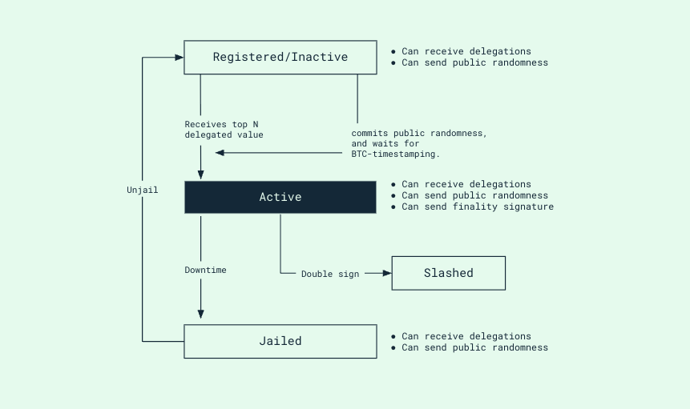

# Finality Provider Core

This doc is to provide basic invariants and heuristics one should follow to
build the finality provider. This part should be agnostic to any consumer
chains.

## Status Transitions

A finality provider has the following 5 possible states: `Registered`,
`Inactive`, `Active`, `Jailed`, `Slashed`. The state transition is depicted
in the following diagram.

.

## Invariants

We define invariants that the finality provider should satisfy:

- The finality provider should submit a finality signature for a block if:
  - the block is not finalized,
  - the finality provider has positive voting power for this block,
  - the finality provider has not cast a finality signature for this block, and
  - the finality provider has cast finality votes for all non-finalized blocks
    prior to this block for which it has voting power.

- The finality provider should commit public randomness for a block if:
  - the block is not finalized, and
  - the finality provider has not committed any randomness for this block

- A finality provider instance should not be running if it’s status is `slashed`
  or `jailed` on Babylon.

### Internal variables

The finality provider maintains the following internal variables.
* `last_voted_height`: the last block height on which the fp has cast a vote,
* `last_processed_height`: the last block height on which the fp either has
  cast a vote or it does not have voting power, and
* `next_height`: the next block to poll.

Internal variables need to satisfy the following rules:
* `last_processed_height >= last_voted_height` should always hold, and
* `next_height = max{latest_finalized_height, last_processed_height} + 1` should
  always hold.

## Heuristics

### Sending finality votes

* The poller polls blocks from `start_height` one by one monotonically.
* `start_height` should be the least height that satisfy
  `start_height = max{latest_finalized_height, last_processed_height} + 1`.
* For the next block from the poller, the finality provider retries to send
  a finality signature until the invariant is not satisfied.

### Committing public randomness

* Finality providers should start to send public randomness commit right
  after it is registered on Babylon. This is because a public randomness commit
  only takes into effect after the committed epoch is finalized. So the finality
  provider should start sending the commit as soon as possible.
* If the remaining randomness is not sufficient (defined by config) by the
  current Babylon Genesis height, the finality provider should make a new commit.
* The next commit should be made with `start_height` right after the last
  committed height. This is to ensure no gap between each commit.

The above approach of committing public randomness may cause waste of some
public randomness in cases where the finality provider does not have voting
power for some heights, but given that the randomness are constructed in a
merkle-tree and the commit only contains the root hash of the tree. Therefore,
the waste is negligible.

### Fast sync

Fast sync is needed for bootstrap and in case the finality provider falls
behind due to network latency.

* The finality provider enters fast sync if:
  * the finality provider is bootstrapping, or
  * the `current_block_height - last_processed_height > gap` (configured value).
  This condition might not be needed if we can do batching in normal processing
  loop.

During fast sync:
1. block the poller,
2. find a range of blocks starting from `last_processed_height + 1` to
   `current_block_height`,
3. check invariant against each of the blocks, batch signature messages, and
   send it to Babylon,
4. clear the buffer of the poller and reset the next height of the poller to
   `last_processed_height + 1`, and
5. unblock the poller.
